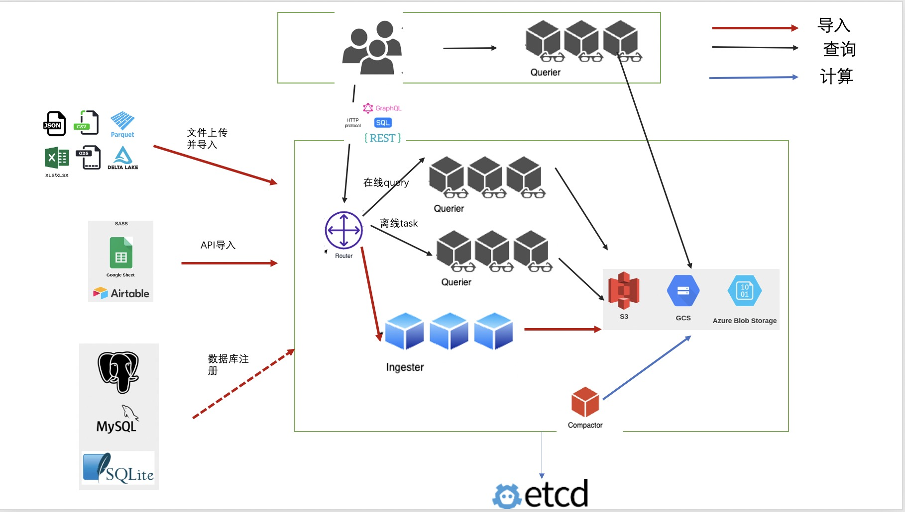

# ROAPI Documentation

[ROAPI](https://github.com/roapi-cloud/roapi-cloud) 为边缘结点的数据服务能力，通过HTTP接口支持了不同种类的查询语言.
主要的特点就是高效和易用性。通过把数据从云端缓存在边缘结点本地的内存中，并且以http服务的方式提供，大大提升了数据应用交付效率.
该服务是基于 [Apache Arrow](https://github.com/apache/arrow),
[Datafusion](https://github.com/apache/arrow-datafusion)和[etcd](https://github.com/etcd-io/etcd). 

核心的设计逻辑如下:

* 通过数据导入服务，完成数据上传和格式转化.
* 查询前端负责翻译 SQL, GraphQL 和 REST API queries 到 Datafusion 执行计划.
* Datafusion 执行生成数据结果，并且转换为用户需要的数据格式并且返回.
* Job任务后续执行，进行数据的整理，索引，备份.
* 整体架构遵循云原生设计原则，每个服务均为无状态服务，并且可以扩容到多个节点上.
  

架构图如下:

> If you'd like to share feedback on how you're using ROAPI, please [fill out this survey](https://docs.google.com/forms/d/1M1s1scZX39UouuVF8WzIFQoSyeKX5dMVQgQMtYJKGZU). Thanks!
